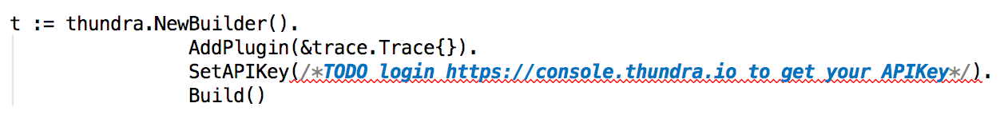

# Thundra Lambda Go Example Project

This is a simple example to trace your lambda go functions with [Thundra](https://www.thundra.io/).

If you haven't done already start by installing **serverless** by:
```bash
npm install serverless -g
```


1 - **Login** to [Thundra](https://console.thundra.io/) to create your API key:


2 - **Paste your `API Key`** to `helloworld.go`



3- **Build** and **deploy** the project using the `deploy.sh`
```bash
sh deploy.sh
```
4- **Invoke** `helloworld` function in `AWS Lambda Console` with the following example parameters
```
{
  "name": "gandalf",
  "age": 11000
}
```

5- **Observe** your trace metrics on [Thundra](https://console.thundra.io/)!

   It might take a couple of minutes for your metrics to become visible.